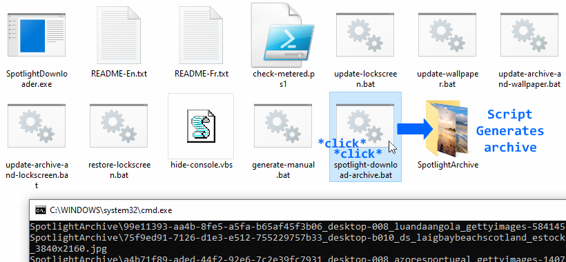



This program can retrieve Windows Spotlight images by requesting the Microsoft Spotlight API.
SpotlightDL can also define images as wallpaper and system-wide lockscreen image.

It is useful in the following use cases:
 - Download most of the Spotlight library with maximum image resolution and metadata
 - Define Spotlight images as wallpaper, not only on Windows 11 but also on previous versions
 - Define Spotlight images as global lock screen on Windows 7+, removing the ads on Windows 10+
 - Chain SpotlightDL with your own scripts and apps by taking advantage of the url mode

# Download

Have a look at the [releases section](https://github.com/ORelio/Spotlight-Downloader/releases) to get a build.

# How to use

## From the command-line (Windows/Mac/Linux)

Simply call `SpotlightDownloader.exe` from the Windows command prompt and see usage.

The `download` and `url` modes should also work on Mac/Linux using the Mono framework.

## Lockscreen Install Program (Windows)

Download the [Lockscreen Setup](https://github.com/ORelio/Spotlight-Downloader/releases) and install it. Your Lock Screen will be replaced with ad-free Spotlight images.

If you no longer need it, you can uninstall it from [App & features](https://support.microsoft.com/en-us/windows/uninstall-or-remove-apps-and-programs-in-windows-4b55f974-2cc6-2d2b-d092-5905080eaf98) like other programs.

## Portable App from File Explorer (Windows)

A few Batch files are offered for ease of use for common tasks.

Download the [Zip Release](https://github.com/ORelio/Spotlight-Downloader/releases), extract it and double click on a script to launch the desired task:



 - `spotlight-download-archive`: Download many images to a SpotlightArchive folder
 - `update-archive-and-wallpaper`: Feed the Archive and use one image as wallpaper
 - `update-archive-and-lockscreen`: Feed the Archive and use one image as lockscreen
 - `update-wallpaper`: Randomize desktop wallpaper (using a fixed-size cache)
 - `update-lockscreen`: Randomize system-wide lockscreen (using a fixed-size cache)
 - `restore-lockscreen`: Restore default system-wide lockscreen
 - `generate-manual`: Generate a text file with command-line usage

If you wish to periodically launch one of these scripts, please refer to the [User Manual](README-En.txt).

# How it works

Creating this app required to overwome two challenges:

1. Determine how the Spotlight API works to download images from it
2. Understand how the Lock Screen works to replace it with arbitrary images

## Spotlight API

By analyzing network traffic originating from Windows 10/11, it was possible to determine how to downloads images.

See [SpotlightAPI.md](SpotlightAPI.md) for details about the Spotlight API endpoints.

## Global lock screen

### Windows 8 and greater

The global lock screen images for Windows 8 and 10 are stored as `C:\Windows\Web\Screen\imgXXX.jpg`.
SpotlightDL backups each image as `imgXXX.jpg.bak` if it does not already exists, then overwrite this file.
The lock screen image cache, located at `C:\ProgramData\Microsoft\Windows\SystemData\S-1-5-18\ReadOnly\LockScreen_*`, must be cleared for the change to take effect.

SpotlightDL gets around NTFS permissions on these folders [being locked down to TrustedInstaller](https://helpdeskgeek.com/windows-7/windows-7-how-to-delete-files-protected-by-trustedinstaller/)
by setting the local `Administrators` group as new owner of the relevant files and folders, and granting full control to this group.
Then, programs running as administrator can overwrite the lockscreen image and clear the cache.

This way of replacing the lockscreen is basically a C# implementation of [this script](https://www.reddit.com/r/PowerShell/comments/5fglby/powershell_to_set_windows_10_lockscreen/daoepvj/),
avoiding the use of the `takeown` and `iacls` commands which are not reliable due to a [localization issue](http://community.idera.com/powershell/ask_the_experts/f/powershell_for_windows-12/10227/trying-to-make-a-takeown-exe-cmdlet-but-locales-is-causing-a-problem).

### Windows 7

Windows 7 has an [OEMBackground](https://www.askvg.com/windows-7-supports-login-screen-customization-without-3rd-party-software-how-to-instructions-inside/) feature in registry allowing custom Logon Screen background:

````
[HKEY_LOCAL_MACHINE\SOFTWARE\Microsoft\Windows\CurrentVersion\Authentication\LogonUI\Background]
"OEMBackground"=dword:00000001
````

Then the image has to be placed in `C:\Windows\System32\oobe\info\backgrounds\backgroundDefault.jpg`.

Windows 7 enforces a limit of 250 KiB, so SpotlightDL will recompress the image to the highest quality fitting in that limit. This results in lower quality lock screen images than Windows 8 and greater, but works without patching anything on the system so the feature is safe to use.

# License

SpotlightDL is provided under [CDDL-1.0](http://opensource.org/licenses/CDDL-1.0) ([Why?](http://qstuff.blogspot.fr/2007/04/why-cddl.html)).

Basically, you can use it or its source for any project, free or commercial, but if you improve it or fix issues,
the license requires you to contribute back by submitting a pull request with your improved version of the code.
Also, credit must be given to the original project, and license notices may not be removed from the code.
