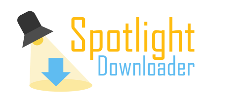

This program can retrieve Windows Spotlight images by requesting the Microsoft Spotlight API.
SpotlightDL can also define images as wallpaper and system-wide lockscreen image.

It is useful in the following use cases:
 - **Download** most of the Spotlight library with maximum image resolution and metadata
 - Define Spotlight images as **ad-less** lockscreen or wallpaper
 - Chain SpotlightDL with your own scripts and apps using the **url mode**

# Download

Have a look at the [releases section](https://github.com/ORelio/Spotlight-Downloader/releases) to get a build. There are two major versions:
* v1.x.x for Windows 7 and greater, Mac and Linux (.NET 4)
* v2.x.x for Windows 10 and greater (.NET 9)

# How to use

## Portable App from File Explorer (Windows)

A few Batch files are offered for ease of use for common tasks.

Download the [Zip Release](https://github.com/ORelio/Spotlight-Downloader/releases), extract it and double click on a script to launch the desired task:


 - `spotlight-download-archive`: Download many images to a SpotlightArchive folder
 - `update-archive-and-wallpaper`: Feed the Archive and use one image for your wallpaper
 - `update-archive-and-lockscreen`: Feed the Archive and use one image for your lockscreen
 - `update-archive-and-lockscreen-all-users`: Same, but system-wide (*)
 - `update-wallpaper`: Randomize desktop wallpaper (using a fixed-size cache)
 - `update-lockscreen`: Randomize your lockscreen (using a fixed-size cache)
 - `update-lockscreen-all-users`: Same, but system-wide (*)
 - `restore-lockscreen`: Restore default system-wide lockscreen
 - `generate-manual`: Generate a text file with command-line usage

_(*) Requires Administrator Privileges, and at least Pro edition (Home edition not supported)._

If you wish to periodically launch one of these scripts, please refer to the [User Manual](README-En.txt).

## Lockscreen Install Program (Windows)

Download the [Lockscreen Setup](https://github.com/ORelio/Spotlight-Downloader/releases) and install it. Your Lock Screen will be replaced with ad-free Spotlight images. It will also be set system-wide if supported by your Windows edition.

If you no longer need it, you can uninstall it from [App & features](https://support.microsoft.com/en-us/windows/uninstall-or-remove-apps-and-programs-in-windows-4b55f974-2cc6-2d2b-d092-5905080eaf98) like other programs.

## From the command-line (Windows)

Simply call `SpotlightDownloader.exe` from the Windows command prompt and see usage.

## Using Mono (Mac/Linux)

**For now, please use versions numbered v1.x.x for Mac and Linux.**

The `download` and `url` modes should also work on Mac/Linux using the Mono framework:

* On Mac: https://www.mono-project.com/download/stable/#download-mac
* On Linux: `sudo apt install mono-runtime`

Then, from a terminal:

```bash
mono SpotlightDownloader.exe
```
Example: Downloading Spotlight Archive:

```bash
mkdir SpotlightArchive
mono SpotlightDownloader.exe download --many --maxres --metadata --outdir SpotlightArchive
```

If you get TLS errors using Mono, try running `mozroots --import --ask-remove` once to install TLS root certificates on your computer.

If Mono crashes, try installing `mono-complete` instead of `mono-runtime`. Use at least Mono v4.0.

# How it works

## Spotlight API

By analyzing network traffic originating from Windows 10/11, it was possible to determine how to downloads images.

See [SpotlightAPI.md](SpotlightAPI.md) for details about the Spotlight API endpoints.

## Lock screen

See [LockScreenAPI.md](LockScreenAPI.md) for details about the Lockscreen API.

# License

SpotlightDL is provided under [CDDL-1.0](http://opensource.org/licenses/CDDL-1.0) ([Why?](http://qstuff.blogspot.fr/2007/04/why-cddl.html)).

Basically, you can use it or its source for any project, free or commercial, but if you improve it or fix issues,
the license requires you to contribute back by submitting a pull request with your improved version of the code.
Also, credit must be given to the original project, and license notices may not be removed from the code.
